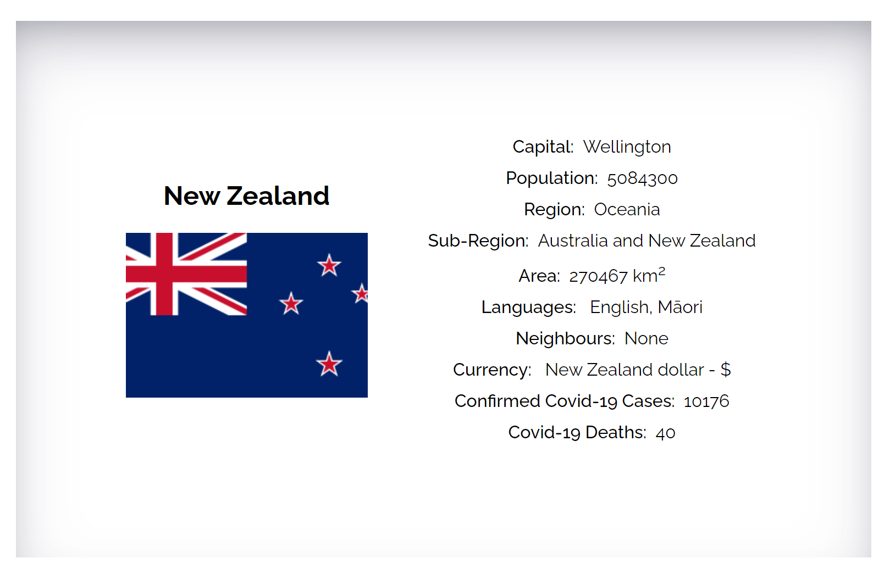

# Country Finder Project - V2

This project is V2 of the country project and has also been developed as part of the DCI API module taught by Syed Naqvi. [[This is a link to Syed Naqvi's github.com/nrcool](https://github.com/nrcool)].

## Library Platform

This project was developed using React. [[This is a link to React](https://reactjs.org/)]

## Rest Countries API

The Country Finder project fetches data dynamically from the Rest Countries API and draws upon API Endpoints V2 and V3  [[This is a link to the Rest Countries API](https://restcountries.com/)]

## Covid-19 API

The Country Finder project also fetches data dynamically from another API with a view to capturing to teh maximum extent possible data regarding the Covid-19 pandemic. [[This is a link to the Covid-19 API](https://api.covid19api.com/)]

## Data

Equivalent to V1 with the exception of the coat of arms.

## Contact Form

The contact me form is grid-based and data is captured via EmaoilJS directly from Javascript.  [This is a link to EmailJS documentation](https://www.emailjs.com/docs/)]

## Snippets

The following are some image snippets. The project is responsive.

